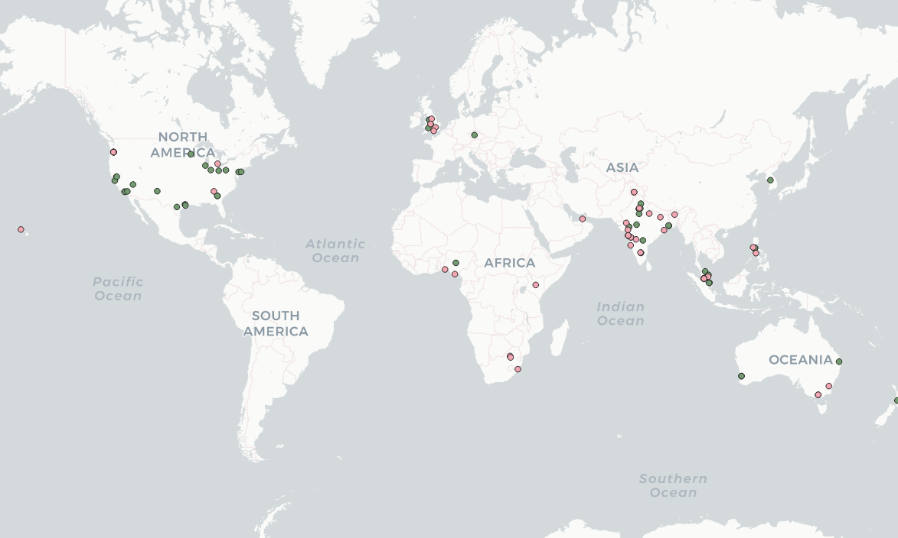

# nelson_458_lab2

I tried two different search topics, and neither one seemed to give the amount of results I wanted, so I combined them.
The green is 'Ice Cream' and the Red is "Police".
It seems india is fairly active at nighttime, as is the UK.
The united states seems to be quiet in the middle.
Perhaps the lower amount of ice cream tweets in the northern us is due to its colder temperatures?
